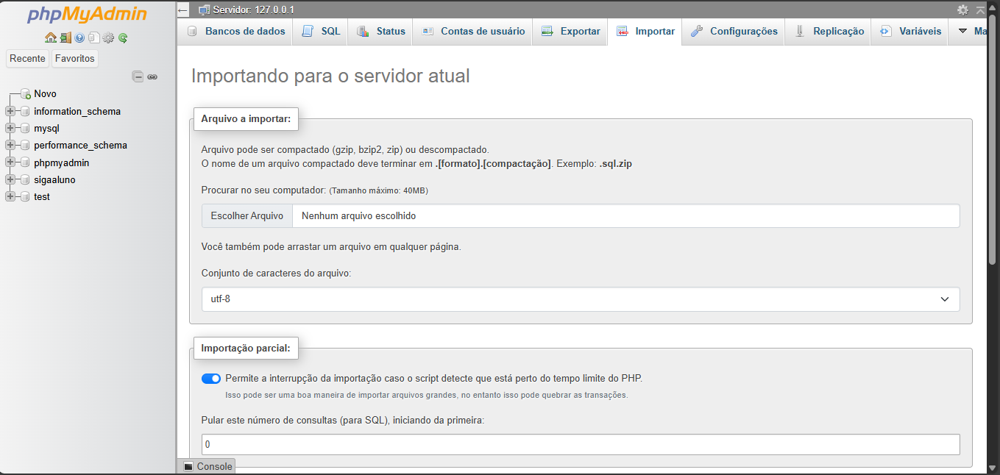

# 🚀 Sprints

## 📚 About the Project

The sprints were graded activities from the 2nd semester of the **Systems Analysis and Development** course at **SENAI**, in 2024. The main goal was to develop a **book management system**, simulating a library environment. The project was carried out in small teams—ours had only three members. The system was inspired by the SESI school, where we studied from Monday to Wednesday, and had SENAI classes on Thursdays and Fridays. The sprints were divided into four phases:

- **Sprint 1**: Focused on demonstrating HTML skills by creating the basic structure of the system (skeleton), without CSS or JavaScript (covered in the following year). A database model was also created, including primary keys, foreign keys, and attributes.
- **Sprint 2**: Introduced CSS for interface styling and PHP for back-end development. Data was handled through forms. The database model remained unchanged, but the structure was disorganized, which was improved in the next phase.
- **Sprint 3**: With better understanding of databases and PHP, we started using **phpMyAdmin (PMA)** to manage the database and implement CRUD operations. We focused on **GET** and **POST**, while **PUT** and **DELETE** were left for the following month. The system was optimized with working registration and query features.
- **Sprint 4**: Finalized all CRUD operations, added foreign key relationships, organized the file structure, and implemented session handling to restrict access to authenticated users only. This marked the full completion of the book management system.

---

## 💻 Technologies Used

We applied technologies learned in the second semester, after starting the year with C programming. Technologies were divided into front-end and back-end:

### 🎨 Front-End:
- **HTML**: Used to structure the system's pages with elements like forms and tables.
- **CSS**: Applied to style the interface, ensuring a clean and user-friendly design.

### 🛠 Back-End:
- **PHP**: Used to implement server-side logic, data handling, and database interaction.
- **phpMyAdmin**: Tool for managing the database and performing CRUD operations.

---

## 📂 Repository Structure

The project is divided into four main folders, each representing a sprint from the **Systems Analysis and Development** course at **SENAI** in 2024:

### `/Sprint1`
Includes:
- `html` folder with the basic system structure;
- `.docx` report;
- Image of the database model;
- Excel version of the model.

### `/Sprint2`
Includes:
- `BD` folder with the database model image;
- `site` folder containing HTML, CSS, and PHP files;
- `.docx` report.

### `/Sprint3`
Includes:
- A more organized structure:
  - Unified CSS in `css`;
  - Images in `img`;
  - SQL import/export scripts in `sql`;
  - `.html` and `.php` files integrated with PMA.

### `/Sprint4`
Includes:
- Structure similar to Sprint 3;
- Files for testing, error display, and final CRUD implementations for loan and return features.

---

## 🚀 Installation & Execution

### ✅ Prerequisites

To run the project locally, make sure the following software is installed:

- [Visual Studio Code](https://code.visualstudio.com/) (recommended) or any IDE of your choice;
- [XAMPP](https://www.apachefriends.org/)
- [phpMyAdmin](https://www.phpmyadmin.net/) (included with XAMPP)

---

### 🧱 Sprint 1

You can run the Sprint 1 project in **Visual Studio Code (VSC)** using two methods:

#### 1. Run & Debug (Sidebar)
- In the left menu, click the **4th icon (Run and Debug)**;
- Click **“Run and Debug”**;
- Choose your preferred browser;
- 

#### 2. Using *Live Server* Extension
- Install the **Live Server** extension from the Extensions panel (5th icon);
- Once installed, click **Go Live** at the bottom-right corner;
- The project will open at `http://127.0.0.1`;
- 

---

### 🧱 Sprint 2

In this sprint, **PHP** is introduced, so a local server like **XAMPP** is required.

#### 1. Start XAMPP
- Open the XAMPP control panel;
- Click **Start** next to **Apache**;
- Visit:
  - `http://localhost/Sprint2` (port 80), or
  - `http://localhost:81/Sprint2` (port 81)

> ⚠️ Make sure the project folder is inside `xampp/htdocs`.

---

### 🧱 Sprints 3 & 4

These sprints use **phpMyAdmin (PMA)** to manage the database, and the `sql` folder contains `.sql` files for importing/exporting data.

#### 1. Launch phpMyAdmin
- Start **Apache** and **MySQL** in XAMPP;
- Access:
  - `http://localhost/phpmyadmin`, or
  - `http://localhost:81/phpmyadmin`
- 

#### 2. Create the Database
- Click **New** on the left menu;
- Enter `biblioteca_sprint` and click **Create**;

> 💡 You can also create it via SQL (optional).

#### 3. Import the Data
1. Click on `biblioteca_sprint` in the left menu;
2. Go to the **Import** tab;
3. Choose the `.sql` file from the `sql` folder;
4. Click **Import** and wait for the success message;
5. Done! Your tables are ready.

> 💡 Tip: Importing the `.sql` file avoids manual errors and is faster.

---

## 👥 Authors

The project was developed by:

- João Pedro Dala Dea Mello  
- Renan Cadamuro Carrara  
- Ana Júlia Martins da Silva  

---

## 📌 Project Status

✅ Completed in December 2024 as part of the course's sprint evaluations.
